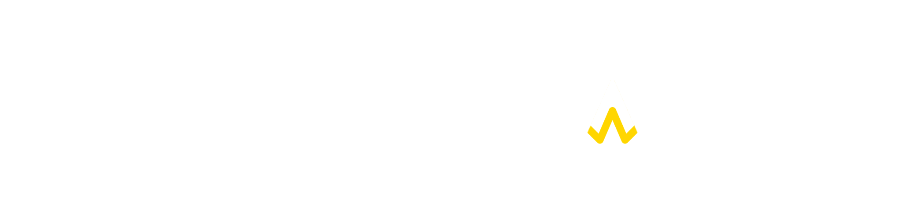
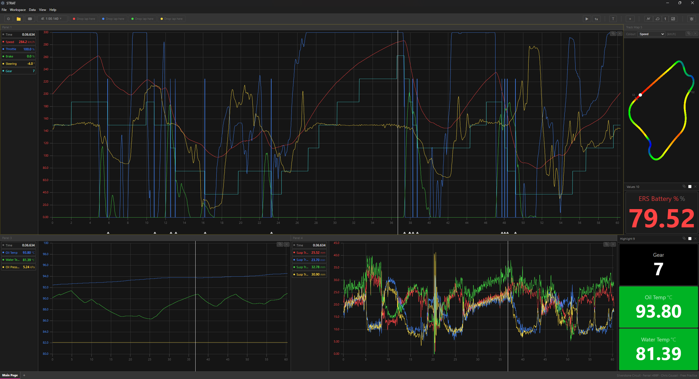

  

  <strong>Sim Telemetry & Racing Analytics Tool</strong> 
  <em>Built in the real world, for the virtual one.</em>

  
  
  
  

---

STRAT is a free telemetry analysis tool built from the ground up for sim racing. Load your session data, compare laps, and find the time you're missing.

**Currently supports iRacing.** Le Mans Ultimate and more sims coming.

## Features

- **Multi-panel workspace** — up to 4 independent trace views side by side, linked zoom
- **Lap comparison** — overlay up to 4 laps from any session, cross-session support
- **Track map** — 2D circuit visualisation colour-coded by any channel, cursor linked to traces
- **Math channels** — create custom derived channels from existing data
- **Dual cursors** — click to place, measure gaps between any two points
- **Data export** — CSV and PNG export
- **Session browser** — auto-detects your telemetry folder, filterable by car, track, date
- **Free. Forever.** No subscriptions, no paywalls

  

## Download

Grab the latest release from the [Releases page](https://github.com/chriscousall/STRAT/releases/latest).

Windows only. Extract the .zip and run `STRAT.exe`. It auto-detects your iRacing telemetry folder on first launch.

## Roadmap

| Phase | What's coming |
|-------|--------------|
| **Current** | Bug fixes, more telemetry parameters, UI polish |
| **Next** | Live telemetry, expanded parameters, Le Mans Ultimate support, sector analysis |
| **Later** | Video sync, AI corner analysis, community sharing |

## Feedback

Found a bug or have an idea? [Open an issue](https://github.com/chriscousall/STRAT/issues).

## Links

- **Website:** [strat.cousall.net](https://strat.cousall.net)

---

  Source-available. Free to use. See <a href="LICENSE">LICENSE</a> for details.

